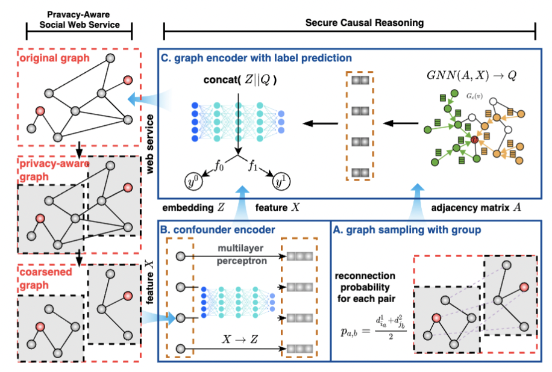

# Cecoar

Code for the ICWS '24 paper, Secure Causal Reasoning on Coarsened Graph for Privacy-aware Social Web Services.

**First Work on Causal Effect Estimation on Coarsened Graph with unobserved edges**

### Overview of the Network Deconfounder

